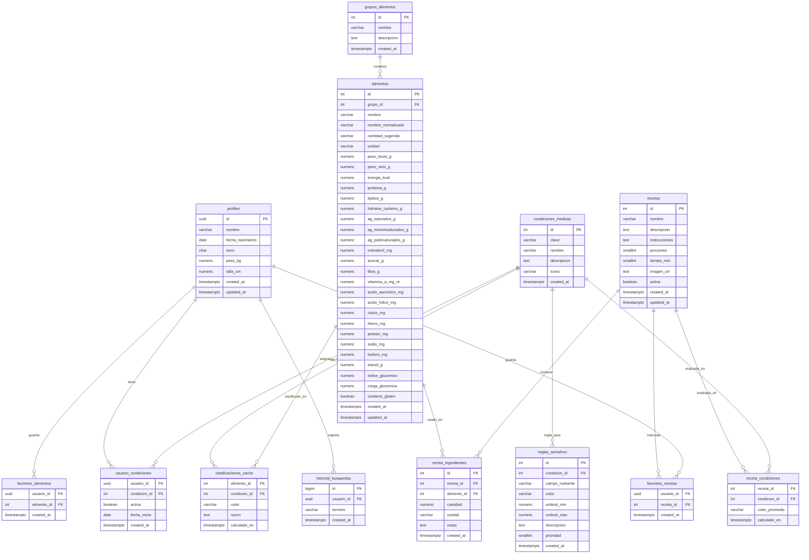
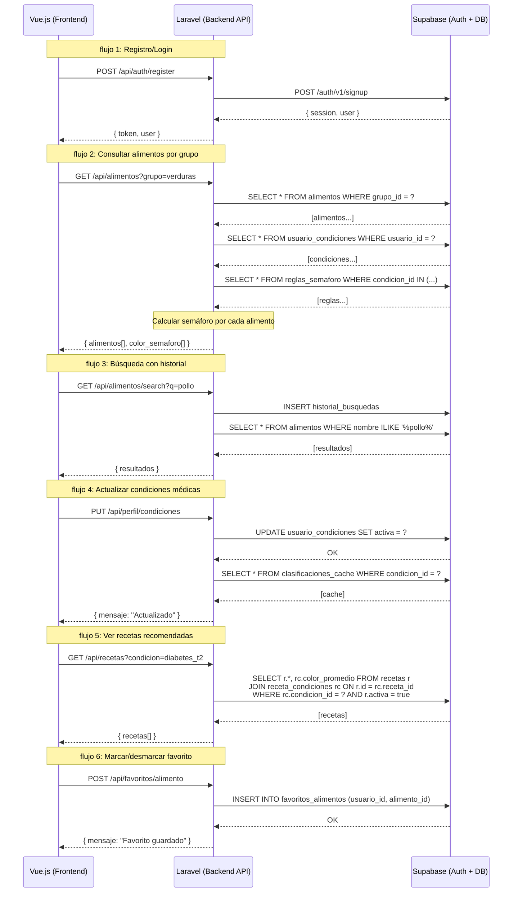

# FoodLight - Diagramas del Proyecto

## 1. Diagrama de Entidad-Relación (DER)



---

## 2. Diagrama de Secuencia



---

## 3. Diagrama de Clases

```mermaid
classDiagram
    %% =============================================================================
    %% FRONTEND - VUE.JS + PINIA
    %% =============================================================================

    class AuthStore {
        +user: User | null
        +session: Session | null
        +isAuthenticated: boolean
        +loading: boolean
        +error: string | null
        +login(email, password): Promise~void~
        +register(email, password, nombre): Promise~void~
        +logout(): Promise~void~
        +fetchSession(): Promise~void~
    }

    class AlimentosStore {
        +alimentos: Alimento[]
        +alimentoActual: Alimento | null
        +grupos: GrupoAlimento[]
        +filtros: FiltrosBusqueda
        +loading: boolean
        +error: string | null
        +fetchAlimentos(grupoId?): Promise~void~
        +searchAlimentos(query): Promise~void~
        +getAlimentoById(id): Promise~void~
        +fetchGrupos(): Promise~void~
    }

    class RecetasStore {
        +recetas: Receta[]
        +recetaActual: Receta | null
        +ingredientesReceta: RecetaIngrediente[]
        +loading: boolean
        +error: string | null
        +fetchRecetas(filtros?): Promise~void~
        +fetchRecetasPorCondicion(condicionId): Promise~void~
    }

    class PerfilStore {
        +perfil: Perfil
        +condiciones: CondicionUsuario[]
        +condicionesDisponibles: CondicionMedica[]
        +loading: boolean
        +error: string | null
        +fetchPerfil(): Promise~void~
        +updatePerfil(data): Promise~void~
        +fetchCondiciones(): Promise~void~
    }

    class FavoritosStore {
        +alimentosFavoritos: Alimento[]
        +recetasFavoritas: Receta[]
        +loading: boolean
        +toggleAlimentoFavorito(alimentoId): Promise~void~
        +toggleRecetaFavorita(recetaId): Promise~void~
    }

    class HistorialStore {
        +busquedas: HistorialBusqueda[]
        +loading: boolean
        +addBusqueda(termino): Promise~void~
        +fetchHistorial(): Promise~void~
    }

    class User {
        +id: string
        +email: string
        +nombre?: string
    }

    class Alimento {
        +id: number
        +grupo_id: number
        +nombre: string
        +energia_kcal: number
        +proteina_g: number
        +lipidos_g: number
        +hidratos_carbono_g: number
        +azucar_g: number
        +fibra_g: number
        +sodio_mg: number
        +indice_glucemico: number
        +contiene_gluten: boolean
        +color_semaforo?: string
    }

    class GrupoAlimento {
        +id: number
        +nombre: string
        +descripcion: string
    }

    class Receta {
        +id: number
        +nombre: string
        +descripcion: string
        +instrucciones: string
        +porciones: number
        +tiempo_min: number
        +imagen_url: string
    }

    class RecetaIngrediente {
        +id: number
        +receta_id: number
        +alimento_id: number
        +cantidad: number
        +unidad: string
    }

    class Perfil {
        +id: string
        +nombre: string
        +fecha_nacimiento: string
        +sexo: 'M' | 'F' | 'O'
        +peso_kg: number
        +talla_cm: number
    }

    class CondicionMedica {
        +id: number
        +clave: string
        +nombre: string
        +descripcion: string
        +icono: string
    }

    class FiltrosBusqueda {
        +grupo_id?: number
        +texto?: string
        +semaforo?: 'verde' | 'amarillo' | 'rojo'
    }

    %% Controllers Laravel
    class AuthController {
        +register(Request): JsonResponse
        +login(Request): JsonResponse
        +logout(Request): JsonResponse
        +me(Request): JsonResponse
    }

    class AlimentoController {
        +index(Request): JsonResponse
        +show(int $id): JsonResponse
        +search(Request): JsonResponse
    }

    class RecetaController {
        +index(Request): JsonResponse
        +show(int $id): JsonResponse
        +porCondicion(Request): JsonResponse
    }

    class PerfilController {
        +show(Request): JsonResponse
        +update(Request): JsonResponse
        +updateCondiciones(Request): JsonResponse
    }

    class FavoritoController {
        +toggleAlimento(Request): JsonResponse
        +toggleReceta(Request): JsonResponse
    }

    %% Services Laravel
    class SemaforoService {
        +calcularColor(Alimento $alimento, array $condiciones): array
        +aplicarReglas(Alimento $alimento, Collection $reglas): array
    }

    class NutricionService {
        +calcularPorcion(Alimento $alimento, float $cantidad): array
        +sumarNutricion(array $ingredientes): array
    }

    %% Models Laravel
    class Alimento {
        +id: int
        +grupo_id: int
        +nombre: string
        +grupo(): BelongsTo
    }

    class Receta {
        +id: int
        +nombre: string
        +ingredientes(): HasMany
    }

    class RecetaIngrediente {
        +id: int
        +receta_id: int
        +alimento_id: int
        +alimento(): BelongsTo
    }

    class Profile {
        +id: UUID
        +nombre: string
        +condiciones(): BelongsToMany
    }

    class ReglaSemaforo {
        +id: int
        +condicion_id: int
        +campo_nutriente: string
        +color: string
    }

    class CondicionMedica {
        +id: int
        +clave: string
        +nombre: string
        +reglas(): HasMany
    }

    %% Relaciones Frontend
    AuthStore --* AlimentosStore
    AuthStore --* PerfilStore

    %% Relaciones Backend
    AuthController --> AuthService
    AlimentoController --> SemaforoService
    RecetaController --> NutricionService

    %% Model Relations
    Receta --> RecetaIngrediente
    RecetaIngrediente --> Alimento
    Profile --> CondicionMedica
    CondicionMedica --> ReglaSemaforo
```



---

## Instrucciones para Exportar a PNG

### Opción 1: Mermaid Live Editor
1. Copia solo el código dentro de las marcas ````mermaid`
2. Ve a https://mermaid.live/
3. Pega el código
4. Click en "Download PNG"

### Opción 2: VS Code
1. Instala la extensión "Mermaid Preview" o "Mermaid Diagram"
2. Abre este archivo en VS Code
3. Click derecho en el código Mermaid → "Export to PNG"

### Opción 3: Draw.io (diagrams.net)
1. Ve a https://app.diagrams.net/
2. Arrange → Insert → Advanced → Mermaid
3. Pega el código Mermaid
4. File → Export as → PNG