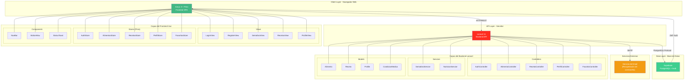

# Diagrama de Arquitectura

```mermaid
graph TB
    subgraph "Client Layer - Navegador Web"
        Vue["Vue.js 3 + Pinia<br/>Frontend SPA"]
    end

    subgraph "API Layer - Servidor"
        Laravel["Laravel 11<br/>Backend API"]
    end

    subgraph "Data Layer - Base de Datos"
        Supabase["Supabase<br/>PostgreSQL + Auth"]
    end

    subgraph "Servicios Externos"
        Email["Servicio de Email<br/>(Recuperación de contraseña)"]
    end

    Vue -->|HTTP/REST| Laravel
    Laravel -->|PostgreSQL Protocol| Supabase
    Laravel -->|SMTP| Email
    Supabase -->|JWT Auth| Vue

    style Vue fill:#42b883,color:#fff
    style Laravel fill:#ff2d20,color:#fff
    style Supabase fill:#3ecf8e,color:#fff
    style Email fill:#f39c12,color:#fff

    subgraph "Capas del Frontend Vue"
        subgraph "Views"
            V1["LoginView"]
            V2["RegisterView"]
            V3["SemaforoView"]
            V4["RecetasView"]
            V5["ProfileView"]
        end
        subgraph "Stores (Pinia)"
            S1["AuthStore"]
            S2["AlimentosStore"]
            S3["RecetasStore"]
            S4["PerfilStore"]
            S5["FavoritosStore"]
        end
        subgraph "Components"
            C1["NavBar"]
            C2["BottomNav"]
            C3["StatusToast"]
        end
    end

    subgraph "Capas del Backend Laravel"
        subgraph "Controllers"
            AC["AuthController"]
            AlC["AlimentoController"]
            RC["RecetaController"]
            PC["PerfilController"]
            FC["FavoritoController"]
        end
        subgraph "Services"
            SS["SemaforoService"]
            NS["NutricionService"]
        end
        subgraph "Models"
            M1["Alimento"]
            M2["Receta"]
            M3["Profile"]
            M4["CondicionMedica"]
        end
    end

    Vue --- V1
    Vue --- V2
    Vue --- V3
    Vue --- V4
    Vue --- V5
    Vue --- S1
    Vue --- S2
    Vue --- S3
    Vue --- S4
    Vue --- S5
    Vue --- C1
    Vue --- C2
    Vue --- C3

    Laravel --- AC
    Laravel --- AlC
    Laravel --- RC
    Laravel --- PC
    Laravel --- FC
    Laravel --- SS
    Laravel --- NS
    Laravel --- M1
    Laravel --- M2
    Laravel --- M3
    Laravel --- M4
```